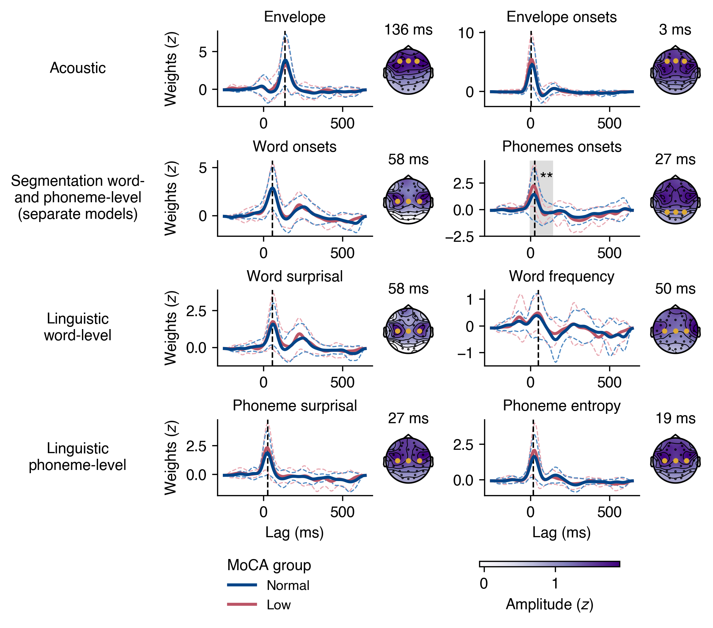

# Acoustic and linguistic ecoding analysis pipelines for mTRF models based on natural continuous speech

## Description

This repository hosts the data processing pielines and statistical models described in our paper entitled "Neural encoding of linguistic speech cues is unaffected by cognitive decline, but decreases with increasing hearing impairment", [doi:10.1038/s41598-024-69602-1](https://www.nature.com/articles/s41598-024-69602-1).

We share the code for reasons of transparency. The data—Electroencephalography (EEG) and audio files—cannot be shared, but are available upon request. The code is adapted to our environment and data infrastructure and cannot be executed without adjustments.

## Structure

Please note:

* The required modules for executing our code are listed in the `environment.yml` file.
* All data paths in the configuration file must be adapted to match your own data infrastructure.

### Data preprocessing
The EEG and speech preprocessing pipelines are located under `preprocessing`, which contains two directories, `eeg` and `speech`:

* `preprocessing/eeg`: Contains the pipelines used for preprocessing the EEG data for multivariate Temporal Response Function (mTRF) analysis.
* `preprocessing/speech`: Comprises two subdirectories:
    * `representations`: Includes pipelines for computing linguistic markers (segmentation, word-based, and phoneme-based speech features for the mTRF models) from the output of the forced aligner. Please note that I used a different environment to run these scripts, detailed in `linfeatures.yml`.
    * `features`: Contains pipelines to generate acoustic and linguistic time series as speech features for the mTRF model.

### Boosting

The mTRF models were created using techniques from the Eelbrain Toolbox. For a detailed explanation and methodology, refer to [Brodbeck et al. (2023)](https://doi.org/10.7554/eLife.85012). The `boosting` directory holds all scripts used to set up the models as described in our paper.

### Statistics

This folder contains the R and Python scripts used to run the statistical models and perform the descriptive statistics reported in the main manuscript and supplementary material. These scripts ensure reproducibility and transparency of our data analysis processes.

